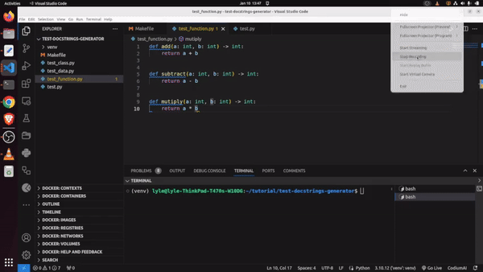

# documentation-generator

## Overeview

This is a python library for generating documentation for python projects. It is built to:

- Generate function docstrings
- Generate class docstrings include class method docstrings (still under development)
- Generate sphinx documentation (still under development)

The library uses ``openai's`` gpt model to generate the function docstrings. You pass it a file or folder path togther with an ``openai`` api key. It then parses the folder for python files, then for each file, it finds the functions and classes, generates their documentation and updates their docstrings.

## Requirements

- Python 3.10+
- Works on Linux, Windows, macOS, BSD

## Installation

```sh
pip install oryks-docstring-generator
```

## Usage

First, provide the ``openai``  api key:

```sh
export OPENAI_API_KEY=sk-xxxxxxxxxxx
```

Then run the application, providing the path to the python file to generate docs for or the folder containing the python files:

```sh
python -m docstring_generator --path /home/lyle/tutorial/test-docstrings-generator/test/ --directories-ignore venv
--files-ignore test.py --overwrite-function-docstring True --overwrite-class-docstring True --overwrite-class-methods-docstring True --documentation-style Numpy-Style
```

<p align=center>
  
</p>

## Documentation and Tutorials

To learn more about the library including the documentation and tutorials, check out the [libraries&#39; documentation](https://youtube-wrapper.readthedocs.io/en/latest/).

## How to Contribute

To contribute, chack out the [contribution guideline](CONTRIBUTING.md).

## License

The API uses an [MIT License](LICENSE)

## Developer

Lyle Okoth – [@lyleokoth](https://twitter.com/lyleokoth) on twitter

[lyle okoth](https://medium.com/@lyle-okoth) on medium

My email is lyceokoth@gmail.com

Here is my [GitHub Profile](https://github.com/twyle/)

You can also find me on [Linkedin](https://www.linkedin.com/in/lyle-okoth/)
